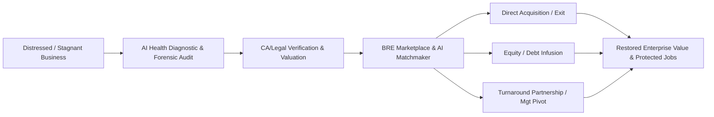

# BUSINESS REVIVAL ECOSYSTEM (BRE) — MASTER PROJECT KNOWLEDGE BASE & EXPERIMENT DIRECTIVE SPECIFICATION

> **Document Type:** Master Project Reference & Autonomous Agent Directive  
> **Project Title:** Business Revival Ecosystem (BRE) / Mintmade Inc.  
> **Tagline:** *"Reviving Businesses. Building Opportunities."* | *"Sell • Invest • Partner • Revive"*  
> **Target Academic Domain:** Entrepreneurship Development (ED) / Startup Incubation Lab & Practicum  
> **Live Web Application Demo:** [https://gleeful-druid-2f010f.netlify.app/](https://gleeful-druid-2f010f.netlify.app/)  
> **Document Purpose:** Universal single-source-of-truth. Any AI agent provided with this document along with an **Experiment (01–10)** or **Assignment (01–06)** name will generate complete, publication-grade academic submissions without ambiguity or hallucination.

---

## TABLE OF CONTENTS
1. [Executive Summary & Core Value Proposition](#1-executive-summary--core-value-proposition)
2. [Problem Statement & Market Gap](#2-problem-statement--market-gap)
3. [The Solution & Product Ecosystem](#3-the-solution--product-ecosystem)
4. [Business Model Canvas (BMC) — Deep Dive](#4-business-model-canvas-bmc--deep-dive)
5. [Empirical Market Research & Validation Data (36-Respondent Baseline)](#5-empirical-market-research--validation-data-36-respondent-baseline)
6. [Technical Architecture & AI Revival Engine](#6-technical-architecture--ai-revival-engine)
7. [Comprehensive Financial Architecture & Unit Economics](#7-comprehensive-financial-architecture--unit-economics)
8. [Experiment-by-Experiment Generation Guide (Exp 01 – Exp 10)](#8-experiment-by-experiment-generation-guide-exp-01--exp-10)
9. [Assignment-by-Assignment Generation Guide (Assign 01 – Assign 06)](#9-assignment-by-assignment-generation-guide-assign-01--assign-06)
10. [Universal Meta-Prompt for Future AI Agents](#10-universal-meta-prompt-for-future-ai-agents)

---

## 1. EXECUTIVE SUMMARY & CORE VALUE PROPOSITION

### 1.1 Project Overview
**Business Revival Ecosystem (BRE)** is an AI-powered B2B platform and curated marketplace designed to rescue, restructure, transition, and scale viable Micro, Small, and Medium Enterprises (MSMEs) and startups that are on the brink of closure due to non-fatal operational bottlenecks, succession voids, lack of working capital, or management fatigue.

Instead of allowing viable physical and digital assets, human capital, customer goodwill, and supply chains to dissolve into bankruptcy or liquidation, BRE creates a structured **Revival Pipeline**:
1. **Diagnosis & Valuation:** Algorithmic business health scoring, asset valuation, and forensic gap analysis.
2. **Curation & Verification:** Verification protocols backed by Chartered Accountants (CAs), Company Secretaries (CS), and legal professionals.
3. **Strategic Matchmaking:** AI-driven stakeholder matchmaking connecting distressed owners with strategic buyers, turnaround investors, operational co-founders, and debt restructuring institutions.
4. **Execution & Governance:** End-to-end digital escrow, deal structuring, compliance monitoring, and post-acquisition turnaround advisory.



---

## 2. PROBLEM STATEMENT & MARKET GAP

### 2.1 The Crisis of Premature Business Closures
Across India and global emerging markets, over **70% of small business closures** are not caused by an absence of market demand or bad core products, but rather by:
- **Succession Crises:** Aging first-generation founders without family successors willing to take over.
- **Short-Term Liquidity Traps:** Healthy balance sheet margins crippled by delayed receivables, working capital crunches, or sudden regulatory shifts.
- **Management & Technology Deficits:** Traditional brick-and-mortar businesses failing to adopt modern digital marketing, ERPs, or automated supply chain workflows.
- **Asymmetric Information in Business Transfers:** High fraud risk, lack of verified financial reporting, absence of standardized valuation benchmarks, and prohibitive M&A advisory fees for MSMEs.

### 2.2 The Four Stakeholder Dilemmas
| Stakeholder | Pain Point / Current Reality | BRE Antidote |
| :--- | :--- | :--- |
| **Business Owners** | Forced to shut down at zero salvage value; emotional distress; loss of legacy. | Verified exit pathways, capital infusion, or dignified managerial handover. |
| **Aspiring Entrepreneurs** | Starting from scratch has an 80%+ failure rate within 3 years; zero initial cash flow. | Acquire or partner with proven, revenue-generating, cash-flow-positive legacy foundations. |
| **Turnaround Investors** | High discovery cost; unreliable unverified accounting; opaque deal governance. | CA-vetted financials, AI risk-scoring, clear legal escrow, and milestone deal structures. |
| **CAs & Legal Experts** | Scattered freelance advisory gigs with high client acquisition friction. | Direct ecosystem integration, retainer fees, and transaction-based commission. |

---

## 3. THE SOLUTION & PRODUCT ECOSYSTEM

### 3.1 The Three-Pillar Revival Architecture
1. **Pillar I: AI Revival Engine (Diagnostics & Matching)**
   - Algorithmic ingestion of GST filings, P&L, balance sheets, and operational KPIs.
   - Generation of the *Business Health Score (BHS)* and *Turnaround Potential Index (TPI)*.
   - Vector-similarity matching between buyer acquisition criteria and business distress profiles.

2. **Pillar II: Trust & Verification Grid (Professional Consortium)**
   - Certified Chartered Accountants (CA) audit physical inventories, tax compliances, and book sanity.
   - Corporate lawyers draft standardized Non-Disclosure Agreements (NDAs), Share Purchase Agreements (SPAs), and Asset Sale Agreements.
   - Elimination of phantom listings and misleading claims.

3. **Pillar III: Transaction & Turnaround Orchestration**
   - In-app milestone-based digital Escrow for security deposits and tranche payouts.
   - Post-deal 100-Day Turnaround Blueprint generator for newly minted owners/partners.

---

## 4. BUSINESS MODEL CANVAS (BMC) — DEEP DIVE

```
+----------------------------------------------------------------------------------------------------+
|                                    BUSINESS MODEL CANVAS                                           |
+--------------------+---------------------+--------------------+--------------------+---------------+
| KEY PARTNERS       | KEY ACTIVITIES      | VALUE              | CUSTOMER           | CUSTOMER      |
| • Chartered        | • AI Business Match | PROPOSITIONS       | RELATIONSHIPS      | SEGMENTS      |
|   Accountants      | • Due Diligence &   | • Preserve assets  | • AI Assistant &   | • Distressed  |
| • Corporate Law    |   Valuation Audit   |   vs. liquidation  |   Automated Scorer |   Owners      |
|   Firms            | • Verified Platform | • Connect owners   | • Dedicated Deal   | • Turnaround  |
| • Angel Networks   |   Curation          |   with buyers      |   Advisors         |   Investors   |
|   & Turnaround VCs | • Escrow & Deal     | • AI Opportunity   | • Verified Trust   | • Next-Gen    |
| • Banks, NBFCs &   |   Structuring       |   Matching         |   Community        |   Entrepreneurs|
|   Debt Funds       +---------------------+ • Full Legal & CA  +--------------------+ • Professional |
| • MSME Ministry &  | KEY RESOURCES       |   Compliance Grid  | CHANNELS           |   Advisors    |
|   Startup India    | • AI Recommendation | • Standardized     | • Web & Mobile App |   (CAs/CS)    |
| • Business Brokers |   Engine            |   Valuation Model  | • LinkedIn B2B     | • Banks &     |
|   & Incubators     | • Vetted Database   |                    | • CA Institute/Bar |   Lenders     |
|                    | • Secure Cloud      |                    |   Council Meets    |               |
|                    |   Platform          |                    | • MSME Trade Expos |               |
+--------------------+---------------------+--------------------+--------------------+---------------+
| COST STRUCTURE                           | REVENUE STREAMS                                         |
| • AI & Platform Development / Cloud SaaS | • Tiered Freemium/Pro Platform Subscriptions            |
| • Legal, Regulatory & Compliance Costs   | • Business Listing & Curation Fees                      |
| • CA & Specialist Audit Payouts          | • 2% to 5% Success Fee on Facilitated Deals / Capital    |
| • Marketing, B2B Acquisition & Sales     | • Comprehensive AI Business Valuation Reports           |
| • Platform Security, Escrow & Support    | • Premium CA/Legal Consultation Retainers & Ad Slots    |
+------------------------------------------+---------------------------------------------------------+
```

---

## 5. EMPIRICAL MARKET RESEARCH & VALIDATION DATA (36-RESPONDENT BASELINE)

*Note: Use this exact statistical dataset in all market research, validation, and analytics lab experiments/assignments.*

### 5.1 Survey Statistics & Breakdown
- **Sample Size ($N$):** 36 verified participants across Founders, Investors, CAs, and Aspirants.
- **Sampling Methodology:** Structured online survey combined with direct practitioner interviews.

| Q# | Survey Dimension / Inquiry | Options & Exact Distribution | Strategic Insight |
| :--- | :--- | :--- | :--- |
| **01** | **Awareness of Closure Causes:** Did you know businesses close due to retirement/capital/management rather than demand? | • Yes: **63.9%**<br>• No: **16.7%**<br>• Not Sure: **19.4%** | Market fundamentally understands that failure is operational/internal, proving the core problem hypothesis. |
| **02** | **Platform Utility:** Would a platform that revives businesses instead of letting them close be useful? | • Very Useful: **30.6%**<br>• Useful: **52.8%**<br>• Neutral: **11.1%**<br>• Not Useful: **5.6%** | **83.4% positive sentiment** demonstrates clear product-market resonance. |
| **03** | **Owner Strategy under Management Crisis:** If you couldn't manage your business, what would you do? | • Find an Investor: **36.1%**<br>• Hire a Manager: **30.6%**<br>• Sell Business: **25.0%**<br>• Find Partner: **5.6%**<br>• Close Business: **2.8%** | **Only 2.8% want to close.** 97.2% actively seek an exit, investment, or partnership solution. |
| **04** | **Preferred Entrepreneurial Path:** If you wanted to start a venture, what would you prefer? | • Start New: **50.0%**<br>• Partner Existing: **25.0%**<br>• Invest Existing: **19.4%**<br>• Buy Existing: **5.6%** | **50% of people** are open to acquiring, investing in, or partnering with established businesses over scratch building. |
| **05** | **Most Crucial Platform Feature:** What is the most critical feature needed? | • Verified Listings: **44.4%**<br>• Valuation Reports: **30.6%**<br>• Legal & CA Support: **22.2%**<br>• Due Diligence: **2.8%** | **Trust & Verification** is the highest priority barrier to entry in the market. |
| **06** | **Platform Trust via Pre-Listing Verification:** Would you trust a platform that verifies before listing? | • Yes: **58.3%**<br>• Maybe: **36.1%**<br>• No: **5.6%** | High verification trust index (**94.4% positive or leaning**). |
| **07** | **Impact of CA/Legal Expert Network:** Would professional network inclusion boost confidence? | • Yes: **83.3%**<br>• Maybe: **13.9%**<br>• No: **2.8%** | Overwhelming validation for integrating professional compliance experts directly. |
| **08** | **Willingness to Pay for Premium Services:** Would you pay for valuation, legal docs, and diligence? | • Yes: **50.0%**<br>• Maybe: **44.4%**<br>• No: **5.6%** | **94.4% monetization potential** across direct and freemium upselling. |
| **09** | **Socio-Economic Impact:** Can BRE reduce closures and protect employment? | • Strongly Agree: **19.4%**<br>• Agree: **55.6%**<br>• Neutral: **25.0%**<br>• Disagree: **0.0%** | **75.0% total agreement** with 0% dissent regarding macro employment protection. |
| **10** | **Adoption & Recommendation Index:** Likelihood to use or recommend the ecosystem? | • Likely: **75.0%**<br>• Very Likely: **16.7%**<br>• Not Sure: **8.3%**<br>• Unlikely: **0.0%** | **91.7% net promoter propensity** confirming high virality and B2B referral strength. |

---

## 6. TECHNICAL ARCHITECTURE & AI REVIVAL ENGINE

### 6.1 Data Ingestion & Diagnostic Pipeline
1. **Financial Vectorization:** OCR ingestion of balance sheets, P&L statements, ITRs, and GSTR-3B filings.
2. **Health Scoring Model:**
   $$\text{BHS} = w_1(\text{Quick Ratio}) + w_2(\text{Debt Service Coverage Ratio}) + w_3(\text{Customer Retention Rate}) + w_4(\text{Asset Tangibility})$$
3. **Turnaround Index Calculation:** Identifies if operational cost restructuring, digital sales enablement, or debt consolidation can return the firm to positive EBITDA within 6 months.

---

## 7. COMPREHENSIVE FINANCIAL ARCHITECTURE & UNIT ECONOMICS

### 7.1 Capital Expenditure (CapEx) & Operational Expenditure (OpEx)
- **Initial Setup (Year 1 CapEx):** ₹12,50,000 (Cloud servers, MVP development, security compliance, legal registrations).
- **Monthly OpEx (Year 1 Baseline):** ₹1,85,000 (Cloud hosting, API tokens, marketing, verification staff).
- **Break-Even Analysis:**
  - **Fixed Costs ($FC$):** ₹22,20,000 / year
  - **Average Revenue Per Transaction ($ARPU$):** ₹35,000 (Blended listing + valuation + success commission)
  - **Variable Cost per Deal ($VC$):** ₹7,000 (Auditor payouts, data pipeline)
  - **Contribution Margin ($CM$):** ₹28,000
  - **Break-Even Volume ($BEP$):**
    $$BEP = \frac{FC}{CM} = \frac{22,20,000}{28,000} \approx 80 \text{ completed deals / transactions per year}$$

---

## 8. EXPERIMENT-BY-EXPERIMENT GENERATION GUIDE (EXP 01 – EXP 10)

*When an agent is prompted to generate any experiment from 01 to 10, strictly follow the corresponding blueprint below:*

### Experiment 01: Business Idea Generation using Mind Mapping
- **Objective:** Apply structured mind-mapping techniques to identify root causes of SME failure and formulate the Business Revival Ecosystem as the holistic solution.
- **Key Sections to Generate:**
  1. *Aim & Theory:* Theory of divergent thinking, Tony Buzan's mind-mapping principles in venture ideation.
  2. *Central Theme Node:* "SME Distress & Liquidation Crisis".
  3. *Primary Branches:* (a) Financial Capital Bottlenecks, (b) Succession & Owner Retirement, (c) Operational & Technological Obsolescence, (d) Deal Market Fragmentation.
  4. *Sub-Branches & Convergence:* Connecting distress nodes to the central solution node: **BRE Multi-Sided Platform**.
  5. *Mind Map Diagram / ASCII Architecture:* Visual tree diagram illustrating the ideation hierarchy.
  6. *Conclusion & Venture Selection Rationale.*

### Experiment 02: Conducting Market Research & Customer Validation
- **Objective:** Validate market necessity, stakeholder willingness-to-pay, and trust factors through empirical survey methodology.
- **Key Sections to Generate:**
  1. *Aim & Theoretical Foundations:* Primary vs secondary research, customer development methodology (Steve Blank).
  2. *Survey Methodology & Sampling Plan:* 36 respondents across business owners, buyers, CAs, investors.
  3. *10-Question Comprehensive Analysis:* Incorporate the exact survey dataset from Section 5 of this document, complete with percentage breakdown and analytical commentary.
  4. *Need, Want, and Demand Analysis:* Detailed theoretical dissection based on empirical data.
  5. *Inferences & Strategic Pivot Recommendations:* Emphasis on verified listings (44.4%) and professional CA network (83.3%).

### Experiment 03: Preparing a Business Model Canvas for a Startup Idea
- **Objective:** Construct an exhaustive, investor-grade Business Model Canvas for the Business Revival Ecosystem.
- **Key Sections to Generate:**
  1. *Aim & Conceptual Overview:* Alexander Osterwalder’s 9-building-block framework.
  2. *Detailed 9-Block Tabular Breakdown:*
     - Customer Segments, Value Propositions, Channels, Customer Relationships, Revenue Streams, Key Resources, Key Activities, Key Partnerships, Cost Structure.
  3. *Inter-Block Dependency Analysis:* How Key Partners (CAs) enable the Core Value Proposition (Trust/Verification), driving Customer Relationships and Revenue Streams.
  4. *Strategic Advantages over Traditional Brokers & Classifieds.*

### Experiment 04: Developing a Financial Plan & Break-Even Analysis
- **Objective:** Formulate a 3-year projected financial model, cash flow forecast, and break-even point analysis for BRE.
- **Key Sections to Generate:**
  1. *Aim & Financial Theory:* Fixed vs. Variable costs, Contribution Margin theory, Margin of Safety, NPV & IRR.
  2. *CapEx & OpEx Schedules:* Detailed itemized cost tables for Year 1, Year 2, and Year 3.
  3. *Revenue Model Matrix:* SaaS subscriptions, 3% deal commission, ₹9,999 valuation reports, CA referral share.
  4. *Mathematical Break-Even Model:* Step-by-step formula execution showing calculation of $BEP_{\text{units}}$ and $BEP_{\text{revenue}}$.
  5. *Sensitivity Analysis:* High-growth vs. Conservative scenario modeling.

### Experiment 05: Creating a Website using WordPress / Wix / Modern Web Stack
- **Objective:** Architect the UI/UX sitemap, functional wireframe structure, interactive components, and live deployment for the BRE web platform.
- **Live Deployment Reference:** [https://gleeful-druid-2f010f.netlify.app/](https://gleeful-druid-2f010f.netlify.app/)
- **Key Sections to Generate:**
  1. *Aim & Web Architecture Principles:* Single-page reactive application + modular multi-page funnel, responsive CSS grid/flexbox, accessibility, conversion rate optimization (CRO).
  2. *Design System & Visual Tokens:*
     - **Color Palette:** Primary Dark Ink (`#0E1B22`), Secondary Slate (`#132630`), Editorial Paper Light (`#F5F1E6`), Accent Oxblood Burgundy (`#7A2331`), Vibrance Teal (`#178E86` / `#2CBAB0`), Heritage Brass (`#C79A45`).
     - **Typography:** Display Serifs (`Fraunces`), Body Sans (`IBM Plex Sans`), Data & Code Mono (`IBM Plex Mono`).
  3. *Core Interactive Web Modules (Implemented on Live Site):*
     - **Hero Section:** Live SVG heartbeat pulse visualizer demonstrating "Decline $\rightarrow$ Intervention $\rightarrow$ Recovery".
     - **Interactive AI Diagnostic Scanner:** Client-side sliders (Revenue trend, Cash runway, Debt-to-revenue %, Morale, Market demand) dynamically rendering real-time Revival Score (0-100), risk badge (Critical, At risk, Stable), SVG trajectory curves, and actionable recommendations.
     - **Interactive Marketplace Feed:** Filterable listing cards across Retail, Food & Bev, Manufacturing, Services, Tech, with live "Request introduction" prompts.
     - **Dynamic Stakeholder Match Finder:** Multi-criteria routing engine calculating ecosystem fit % and time-to-match based on user persona and priorities.
     - **Illustrative Revenue Mix Donut Chart:** Interactive SVG visualization of the 4 core revenue streams.
     - **Role-Based Simulation Dashboard:** Multi-stakeholder view simulator for Owners, Buyers, Investors, and Entrepreneurs.
     - **Pricing & Subscription Tiers:** Scout (\$0/mo), Growth (\$99/mo), Ecosystem (Custom).
     - **FAQ Accordion & Clean Footer.**
  4. *CMS & Deployment Alternatives:* Migration blueprint for WordPress/Elementor + WooCommerce Escrow or Webflow CMS.

### Experiment 06: Social Media Marketing Campaign using Open-Source Tools
- **Objective:** Plan and schedule an integrated B2B multi-channel digital acquisition campaign for owners, investors, and CAs using open-source / freemium growth tools.
- **Key Sections to Generate:**
  1. *Aim & Digital Marketing Theory:* Inbound marketing funnels, B2B lead generation, organic CAC reduction.
  2. *Tool Stack:* Canva / GIMP / Inkscape (Creative design), Meta Business Suite / Buffer / Hootsuite (Scheduling), Google Analytics / Matomo (Open-source tracking).
  3. *Multi-Persona Content Calendar (30-Day Matrix):*
     - For Distressed Owners: "Don't Liquidate at Zero: 3 Ways to Unlock Equity."
     - For Young Entrepreneurs: "Why Buying a Profitable Legacy Business Beats Starting from Scratch."
     - For CAs: "Monetize Your Turnaround Expertise on BRE."
  4. *Key Performance Indicators (KPIs):* CTR, CPA, Lead Form Fill Rate, Organic Reach.

### Experiment 07: Digital Prototyping using Figma / Inkscape
- **Objective:** Design interactive, high-fidelity UI/UX prototype screens for the core BRE user journey matching the live Netlify web application.
- **Key Sections to Generate:**
  1. *Aim & Design System Standards:* Atomic design hierarchy, responsive 12-column grid, Fraunces + IBM Plex typography pairing, dark/light high-contrast aesthetic.
  2. *Core Screen & Dashboard Specifications (Mirroring Live Platform):*
     - **Screen 1 (Business Owner Portal):** AI Health Score gauge (87/100 Healthy), Estimated Valuation card (₹3.42 Cr), Legal Compliance check (98%), YoY Revenue growth (+24%), Data room access logs, buyer shortlists.
     - **Screen 2 (Business Buyer Portal):** Deal analytics ROI forecast (32.6%), shortlisted targets across manufacturing/F&B/retail, average health score matrix, deal room diligence status.
     - **Screen 3 (Turnaround Investor Portal):** Investment match score (98%), Portfolio deployed (₹18.7M), open verified opportunities list, CA diligence desk access.
     - **Screen 4 (Next-Gen Entrepreneur Portal):** "Ready-to-Run" business search, Day-1 cashflow metrics, financing & working capital options, step-by-step turnaround playbooks.
  3. *User Flow Diagrams, State Transitions, and Component Libraries.*

### Experiment 08: Business Pitch Deck Preparation & Presentation
- **Objective:** Construct a compelling 10-to-12 slide investor pitch deck formatted for venture capitalists and angel networks.
- **Key Sections to Generate:**
  1. *Slide 1:* Cover & Vision (Tagline, Founders).
  2. *Slide 2:* The Problem (₹50,000+ Cr lost annually in premature SME liquidations).
  3. *Slide 3:* The Solution (Business Revival Ecosystem).
  4. *Slide 4:* Market Size (TAM, SAM, SOM in MSME acquisitions & distress funding).
  5. *Slide 5:* Product & AI Engine Architecture.
  6. *Slide 6:* Business Model & Revenue Drivers.
  7. *Slide 7:* Traction & Validation (36-respondent 94.4% positive sentiment).
  8. *Slide 8:* Competitive Landscape & Moat (CA-vetted trust network vs unverified classifieds).
  9. *Slide 9:* Financial Projections & Unit Economics (3-Year forecast).
  10. *Slide 10:* The Ask & Capital Allocation (₹50 Lakhs seed round distribution).

### Experiment 09: Exploring Government Schemes for Startups
- **Objective:** Map institutional government funding, subsidies, and statutory support schemes to the BRE platform and its turnaround beneficiaries.
- **Key Sections to Generate:**
  1. *Aim & Policy Framework:* The role of government schemes in de-risking SME failure.
  2. *Mapped National Schemes:*
     - **Startup India Seed Fund Scheme (SISFS):** For BRE platform scaling.
     - **CGTMSE (Credit Guarantee Fund Trust for Micro and Small Enterprises):** Collateral-free debt for reviving units.
     - **MSME SAMADHAAN & SAMBANDH:** Addressing delayed receivables for distressed listings.
     - **PMEGP & Stand-Up India:** Facilitating acquisition capital for new buyers.
  3. *Application Roadmap & Compliance Matrix for Platform Listings.*

### Experiment 10: Legal Compliance & IPR Basics (Case Study)
- **Objective:** Establish the legal framework, statutory compliance obligations, intellectual property protections, and contractual mechanics for business transfers.
- **Key Sections to Generate:**
  1. *Aim & Corporate Governance Framework:* Companies Act 2013, MSMED Act 2006, IBC (Insolvency and Bankruptcy Code basics for pre-pack resolution).
  2. *Intellectual Property (IPR) Portfolio:* Trademarking "Business Revival Ecosystem" & "Turnaround Potential Index", copyrighting algorithmic valuation code, trade secret protection.
  3. *Comprehensive Contractual Ecosystem:* Standardized NDAs, Letters of Intent (LOI), Share Purchase Agreements (SPA), Asset Transfer Deeds, Escrow covenants.
  4. *Case Study Scenario:* Walkthrough of a distressed manufacturing firm transferred to a young entrepreneur with zero legal friction.

---

## 9. ASSIGNMENT-BY-ASSIGNMENT GENERATION GUIDE (ASSIGN 01 – ASSIGN 06)

*When an agent is prompted to generate any assignment from 01 to 06, strictly follow the corresponding blueprint below:*

### Assignment 01:
#### Part (a): Report on a Successful Entrepreneur & Startup Journey
- **Focus:** Analyze a renowned turnaround entrepreneur or platform pioneer (e.g., Sanjeev Bikhchandani of Info Edge, or turnaround investor Howard Marks / Ajay Piramal).
- **Structure:** Background $\rightarrow$ The Core Innovation $\rightarrow$ Challenges Overcome $\rightarrow$ Strategic Pivots $\rightarrow$ Key Takeaways for the Business Revival Ecosystem.

#### Part (b): Comprehensive SWOT Analysis for a Real-Life Startup
- **Focus:** Complete SWOT matrix of **Business Revival Ecosystem (BRE)**.
- **Matrix Content:**
  - *Strengths:* First-mover advantage in AI-driven SME turnaround, CA verification trust barrier, multi-revenue monetization.
  - *Weaknesses:* Cold-start marketplace liquidity, manual auditing bandwidth constraints in early stages.
  - *Opportunities:* ₹10,000+ Cr MSME succession wave, government push for MSME digitization and credit expansion.
  - *Threats:* Unregulated broker syndicates, platform liability on deal defaults, economic macro-shocks.

### Assignment 02: Develop a Business Idea & Create a One-Page Business Plan
- **Focus:** Executive 1-Page Lean Business Plan for BRE.
- **Structure:** Executive Summary, Problem, Solution, Unique Value Proposition (UVP), Target Customer Segments, Key Metrics (OMTM: Monthly Gross Transaction Volume), Cost Structure, Revenue Model, Unfair Advantage.

### Assignment 03: Conduct Market Research Using Surveys & Present Findings
- **Focus:** Formal Academic Research Paper on the 36-respondent empirical validation survey of BRE.
- **Structure:** Abstract $\rightarrow$ Introduction & Research Questions $\rightarrow$ Methodology & Questionnaire Design $\rightarrow$ Data Tabulation & Percentage Analysis (using the 10 data points) $\rightarrow$ Qualitative Thematic Inferences $\rightarrow$ Managerial Implications & Conclusion.

### Assignment 04: Design a Simple Logo and Branding Strategy for a Startup
- **Focus:** Comprehensive Brand Identity Manual & GTM Branding Strategy for Business Revival Ecosystem / Mintmade.
- **Structure:**
  1. *Brand Core:* Mission, Vision, Personality (Authoritative, Empathetic, Dynamic, Secure).
  2. *Visual Identity Design:* Logo concept breakdown (The Phoenix / Interlocking Revival Knot), Color Psychology (Forest Green `#10B981` for wealth restoration + Obsidian Slate `#0F172A` for institutional stability), Typography scale.
  3. *Brand Voice & Tone Guidelines:* Do's and Don'ts in customer messaging.
  4. *Go-To-Market (GTM) Launch Strategy:* PR outreach, CA community workshops, LinkedIn thought leadership.

### Assignment 05: Create a Financial Model and Cost Estimation for a Startup
- **Focus:** Complete 3-Year Financial Model, Pro Forma Income Statement, and Unit Economics.
- **Structure:**
  1. *Assumptions Table:* Pricing tiers, customer acquisition cost (CAC), churn rate, average transaction fee.
  2. *Pro Forma Profit & Loss Statement (Year 1 to Year 3):* Gross Revenue, Cost of Goods/Services Sold, Gross Margin, Operating Expenses (R&D, Sales, G&A), EBITDA, Net Profit.
  3. *Unit Economics Breakdown:* LTV:CAC Ratio (Target: > 4.5x), Payback Period (< 4 months).
  4. *Cash Flow Forecast & Burn Rate Analysis.*

### Assignment 06: Case Study Report on Startup Failure Analysis
- **Focus:** Forensic Autopsy of a Prominent SME / Startup Failure (e.g., a well-known logistics/retail startup failure or a traditional family enterprise collapse) and how the **Business Revival Ecosystem** would have prevented liquidation.
- **Structure:**
  1. *Company Background & Initial Success.*
  2. *The Onset of Distress:* The fatal missteps (over-leveraged debt, lack of digital transition, founder burnout).
  3. *Root Cause Breakdown:* Financial, Operational, and Managerial failure analysis.
  4. *The BRE Turnaround Simulation:* Step-by-step prescription of how BRE's AI diagnostics, CA audit, and buyer matching would have orchestrated a profitable turnaround/exit instead of insolvency.
  5. *Key Learnings & Preventive Framework.*

---

## 10. UNIVERSAL META-PROMPT FOR FUTURE AI AGENTS

*Copy-paste the prompt below along with this entire specification file whenever you instruct another agent to generate any specific task:*

```markdown
You are an expert Academic Professor and Venture Capital Consultant in Entrepreneurship Development.
You have been provided with the master specification file for the startup "Business Revival Ecosystem (BRE)".

TASK:
Generate a complete, comprehensive, academic-standard report for:
[INSERT EXPERIMENT NUMBER & TITLE OR ASSIGNMENT NUMBER & TITLE HERE]

GUIDELINES:
1. Adhere strictly to the project data, numbers, survey results (36 respondents), and business model details defined in the BRE Master Specification document.
2. Ensure high academic rigor with all requisite sub-headings: Aim, Theory/Background, Objectives, Methodology/Tools, Detailed Implementation/Analysis, Results/Outputs, Discussion, and Conclusion.
3. Include relevant diagrams, Markdown tables, mathematical formulas, and structured step-by-step workflows.
4. Maintain a professional, publication-ready tone suitable for lab journals, viva evaluations, and investor reviews.
```
